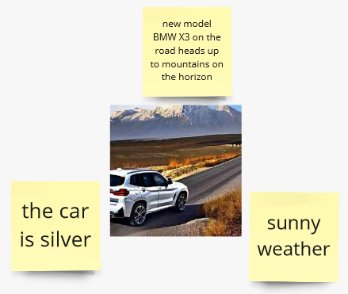

## Getting Started

 **This demo shows three Generative AI use-cases integrated into single solution on [Miro](https://miro.com/miro-aws/) board.** We turn Python notebooks into dynamic interactive experience, where several team members can brainstorm, explore, exchange ideas empowered by privately hosted Sagemaker generative AI models.
This demo can be easily extended by adding use-cases to demonstrate new concepts and solutions.


| Use case               | How it looks like                                           | Details                                                                                       |
|------------------------|-------------------------------------------------------------|-----------------------------------------------------------------------------------------------|
| 1. Image generation    |     | Select one or several yellow stickers, then run app                                           |
| 2. Image inpainting    |  | Change a part of image using **round** shape to define mask and sticky note for change prompt |
| 3. Image trasformation |           | Select image and sticky note connected by line to transform image                             |

Start from brainstorming and then develop your visual idea step-by-step.

 💡 ***Tips: you can use resulted image from previous step as an input for the next.***


### Architecture overview

- **Miro application** is running on the board. Loaded from S3 bucket, accessed via CloudFront distribution. Written on TypeScript.
- **Authorization and AIML proxy lambdas.** Accessed via APIGateway deployed behind CloudFront. Written on Python.
   - ***Authorization functions `authorize` and `onBoard`*** provide access to backend functions only for Miro team members. It's used to protect organization data and generated content in AWS account.
   - ***AIML proxy function `mlInference`*** is required to handle API call from application and redirect it to correct Sagemaker inference endpoint. It also can be used for more complex use-cases, when several AIML functions could be used.
- **Sagemaker inference endpoints.** Run inference.
 


The demo could be extended in two ways: 
1. by adding AIML use cases. 
2. by changing/empowering interface on Miro board or Web-interface.

In both cases existing environment can be used as boilerplate. [More details here](#demo-extension-with-additional-use-cases) 

### Deployment

#### Prerequisites

1. AWS account with access to create
    - [IAM roles](https://docs.aws.amazon.com/IAM/latest/UserGuide/id_roles.html)
    - [ECR](https://docs.aws.amazon.com/AmazonECR/latest/userguide/what-is-ecr.html) repositories
    - [Lambda functions](https://docs.aws.amazon.com/lambda/latest/dg/welcome.html)
    - [API Gateway](https://docs.aws.amazon.com/apigateway/latest/developerguide/welcome.html) endpoints
    - [S3 buckets](https://docs.aws.amazon.com/AmazonS3/latest/userguide/Welcome.html)
    - [CloudFront distributions](https://docs.aws.amazon.com/AmazonCloudFront/latest/DeveloperGuide/Introduction.html)
2. [AWS CLI](https://docs.aws.amazon.com/cli/latest/userguide/cli-chap-install.html) installed and configured
3. [NodeJS](https://nodejs.org/en/download/) installed
4. [NPM](https://www.npmjs.com/get-npm) installed
5. [AWS CDK](https://docs.aws.amazon.com/cdk/latest/guide/getting_started.html) installed
6. [Docker](https://docs.docker.com/get-docker/) installed

**To begin integrating WATool with the Miro application, follow these steps to deploy infrastructure in your AWS account:**

1. Configure CLI access to AWS account via [profile](https://docs.aws.amazon.com/cli/latest/userguide/getting-started-quickstart.html) or [environment variables](https://docs.aws.amazon.com/cli/latest/userguide/cli-configure-envvars.html)
   
   <details>
   <summary>👇 Demo operator user/role policies </summary>
   (steps below developed and tested in Cloud9 and Sagemaker under role with following policies)

   ```
   IAMFullAccess, AmazonS3FullAccess, AmazonSSMFullAccess, 
   CloudFrontFullAccess, AmazonAPIGatewayAdministrator, AWSCloudFormationFullAccess, 
   AWSLambda_FullAccess, AmazonElasticContainerRegistryPublicFullAccess, AmazonSageMakerFullAccess
   ```

   </details>

2. Export AWS_REGION environment variable by run `export AWS_REGION='your region here'` (i.e. `export AWS_REGION='eu-east-1'`), as Lambda function deployment script relies on that
3. Bootstrap CDK stack in the target account: `cdk bootstrap aws://<account_id>/<region>`
4. Docker buildx is required to build Lambda images. It could be either used from [Docker Desktop](https://www.docker.com/products/docker-desktop/) package - no need in steps 4.i and 4.ii in this case; or installed separately (steps below developed and tested on [AWS Cloud9](https://aws.amazon.com/cloud9/)):
   1. [Binary installation manual](https://docs.docker.com/build/install-buildx/)
   2. To enable multiarch building capability launch `docker run --rm --privileged multiarch/qemu-user-static --reset -p yes`
5. For easy deployment just run `npm run deploy` from the project root folder. This will deploy all the necessary stacks in the target account.

### Miro Application

1. Familiarize yourself with Miro's Developer Platform:
   Visit the Miro Developer Platform documentation (**[https://developers.miro.com/docs](https://developers.miro.com/docs)**) to learn about the available APIs, SDKs, and other resources that can help you build your app.
2. Create [Miro Developer Team](https://developers.miro.com/docs/create-a-developer-team)

    

3. Go to the Miro Developer Dashboard (**[https://miro.com/app/dashboard/](https://miro.com/app/dashboard/)**
   ) and click "Create new app". Fill in the necessary information about your app, such as its name, select Developer team. Note: you don't need to check the "Expire user authorization token" checkbox. Click "Create app" to create your app.

    

    

4. Please enter the CloudFront URL that you obtained after the deployment process.

    

5. Add necessary permission.

    

6. Install the app to the team.
   
7. Back to the Miro Developer Dashboard, click "More apps" icon on application bar, find your just installed app in the list and start working.
   

### Sagemaker endpoints

**You need to run dedicated Sagemaker endpoint for each use case.**
Each use-case is supported by a separate Jupyter notebook in **`./ml_services/<use_case>`** subdirectory:
- `1-create_image` image generation (Stable diffusion 2.1), based on [this example](https://github.com/aws/studio-lab-examples/blob/main/generative-deep-learning/stable-diffusion-finetune/JumpStart_Stable_Diffusion_Inference_Only.ipynb)
- `2-inpaint_image` image inpainting (Stable diffusion 2 Inpainting fp16), based on [this example](https://github.com/aws/amazon-sagemaker-examples/blob/main/introduction_to_amazon_algorithms/jumpstart_inpainting/Amazon_JumpStart_Inpainting.ipynb)
- `3-modify_image` image pix2pix modification (Huggingface instruct pix2pix), based on [this example](https://github.com/aws/amazon-sagemaker-examples/tree/main/advanced_functionality/huggingface_deploy_instructpix2pix)

 💡 ***These steps developed and tested in Sagemaker notebook. For cases 1 and 2 you also can use any other ways to run Jumpstart referenced models, i.e. Sagemaker Studio***


#### Starting Sagemaker endpoints

- Go to **./ml_services/<use_case>** directory and run one-by-one all three Sagemaker notebooks.
- After endpoint started and successfully tested in notebook, go to **Miro board**, select required items and run use-case.

### Demo extension with additional use-cases

🛸 ***Extension guidance --TBD--***  ⏳

### License

This sample is licensed under the [Apache 2.0 License](http://aws.amazon.com/apache2.0/). For more details, please take a look at the [LICENSE](LICENSE) file

