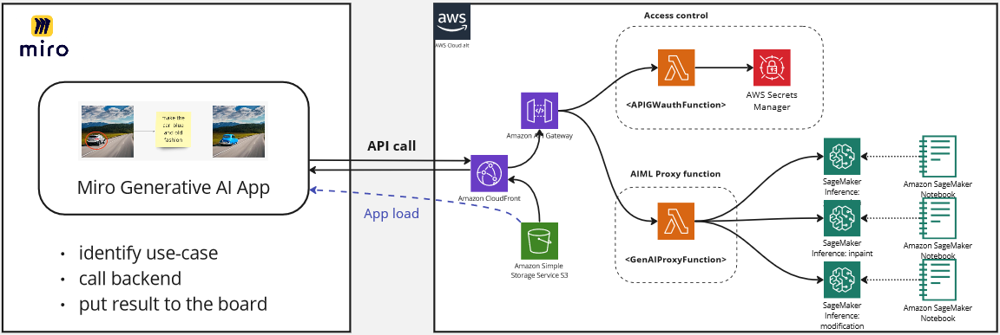

## Getting Started

 **This demo shows three Generative AI use-cases integrated into single solution on [Miro](https://miro.com/miro-aws/) board.** It turns Python notebooks into dynamic interactive experience, where several team members can brainstorm, explore, exchange ideas empowered by privately hosted Sagemaker generative AI models.
This demo can be easily extended by adding use-cases to demonstrate new concepts and solutions.


| Use case               | How it looks like                                           | Details                                                                                       |
|------------------------|-------------------------------------------------------------|-----------------------------------------------------------------------------------------------|
| 1. Image generation    |     | Select one or several yellow stickers, then run app                                           |
| 2. Image inpainting    |  | Change a part of image using **round** shape to define mask and sticky note for change prompt |
| 3. Image trasformation |           | Select image and sticky note connected by line to transform image                             |

Start from brainstorming and then develop your visual idea step-by-step.

 💡 ***Tips: you can use resulted image from previous step as an input for the next.***


### Architecture overview

- **Miro application** is running on the board. Loaded from S3 bucket, accessed via CloudFront distribution. Written on TypeScript.
- **Authorization and AIML proxy lambdas.** Accessed via APIGateway deployed behind CloudFront. Written on Python.
   - ***Authorization function `authorize`*** provide access to backend functions only for authorized Miro application. It's used to protect organization data and generated content in AWS account.
   - ***AIML proxy function `mlInference`*** is required to handle API call from application and redirect it to correct Sagemaker inference endpoint. It also can be used for more complex use-cases, when several AIML functions work.
- **Sagemaker inference endpoints.** Run inference.
 


The demo could be extended in two ways: 
1. by adding new AIML use cases. 
2. by changing/empowering interface on Miro board or Web-interface.

In both cases existing environment can be used as boilerplate. [More details here](#demo-extension-with-additional-use-cases) 

### Deployment

#### Prerequisites

1. AWS account with access to create
    - [IAM roles](https://docs.aws.amazon.com/IAM/latest/UserGuide/id_roles.html)
    - [ECR](https://docs.aws.amazon.com/AmazonECR/latest/userguide/what-is-ecr.html) repositories
    - [Lambda functions](https://docs.aws.amazon.com/lambda/latest/dg/welcome.html)
    - [API Gateway](https://docs.aws.amazon.com/apigateway/latest/developerguide/welcome.html) endpoints
    - [S3 buckets](https://docs.aws.amazon.com/AmazonS3/latest/userguide/Welcome.html)
    - [CloudFront distributions](https://docs.aws.amazon.com/AmazonCloudFront/latest/DeveloperGuide/Introduction.html)
2. [AWS CLI](https://docs.aws.amazon.com/cli/latest/userguide/cli-chap-install.html) installed and configured
3. [NodeJS](https://nodejs.org/en/download/) installed
4. [NPM](https://www.npmjs.com/get-npm) installed
5. [AWS CDK](https://docs.aws.amazon.com/cdk/latest/guide/getting_started.html) installed (min. version 2.83.x is required)
6. [Docker](https://docs.docker.com/get-docker/) installed

## To begin setup Generative AI demo in your AWS account, follow these steps:

### Start with creating Miro application

#### 1. Familiarize yourself with Miro's Developer Platform:
   Visit the Miro Developer Platform documentation (**[https://developers.miro.com/docs](https://developers.miro.com/docs)**) to learn about the available APIs, SDKs, and other resources that can help you build your app.
#### 2. Create [Miro Developer Team](https://developers.miro.com/docs/create-a-developer-team)
💡 If you already have ***Miro Developer Team*** in you account, skip this step.


#### 3. Go to the Miro App management Dashboard (**[https://miro.com/app/settings/user-profile/apps/](https://miro.com/app/settings/user-profile/apps/)**) 
and click "**Create new app**". 


Fill in the necessary information about your app, such as its name, select Developer team. Note: you don't need to check the "Expire user authorization token" checkbox. Click "**Create app**" to create your app.


#### 4. Copy client secret on app creation page


### Now everything ready to set up backend
#### 5. Configure CLI access to AWS account via [profile](https://docs.aws.amazon.com/cli/latest/userguide/getting-started-quickstart.html) or [environment variables](https://docs.aws.amazon.com/cli/latest/userguide/cli-configure-envvars.html)
   
   <details>
   <summary>👇 Demo operator user/role policies </summary>
   (steps below developed and tested in Cloud9 and Sagemaker, role with following policies)

   ```
   IAMFullAccess, AmazonS3FullAccess, AmazonSSMFullAccess, CloudWatchLogsFullAccess,
   CloudFrontFullAccess, AmazonAPIGatewayAdministrator, AWSCloudFormationFullAccess, 
   AWSLambda_FullAccess, AmazonEC2ContainerRegistryFullAccess, AmazonSageMakerFullAccess
   ```

   </details>

#### 6. Export AWS_REGION environment variable 

Run `export AWS_REGION='your region here'` (i.e. `export AWS_REGION='eu-east-1'`), it required for Lambda function deployment script
#### 7. Bootstrap CDK stack in the target account: 
`cdk bootstrap aws://<account_id>/<region>`

#### 8. Docker buildx is required to build Graviton2 Lambda images on x86 platform. 
It could be either used from [Docker Desktop](https://www.docker.com/products/docker-desktop/) package - no need in steps 4.i and 4.ii in this case; or installed separately (steps below developed and tested on [AWS Cloud9](https://aws.amazon.com/cloud9/)):
   1. [Binary installation manual](https://docs.docker.com/build/install-buildx/)
   2. On x86 platform to enable multiarch building capability launch
   
      `docker run --rm --privileged multiarch/qemu-user-static --reset -p yes`

#### 9. Configure Miro application client secret 
Edit `deployment-config.json` to authorize Miro application to access backend. Find the following parameter and put as value secret string you received in [step 4](#4-copy-client-secret-on-app-creation-page).
```
"clientAppSecret": "ADD_MIRO_APP_CLIENT_SECRET_HERE",
```

#### 10. Deploy backend
Run `npm run deploy` from the project root folder. You will be requested to provide ``application client secret`` to continue installation. When installation is completed, all the necessary resources are deployed as **CloudFormation** `DeployStack` in the target account. Write down CloudFront HTTPS distrubution address:
```
    DeployStack.DistributionOutput = xyz123456.cloudfront.net
```


#### 11. Return to Miro application creation dialog to complete app configuration
Please enter the CloudFront URL that you obtained on the previous step.


#### 12. Add necessary permission.


#### 13. Install the app to the team.


#### 14. Back to the Miro Developer Dashboard, click "More apps" icon on application bar, find your just installed app in the list and start working.


### Sagemaker endpoints

**You need to run dedicated Sagemaker endpoint for each use case.**
Each use-case is supported by a separate Jupyter notebook in **`./ml_services/<use_case>`** subdirectory:
- `1-create_image` image generation (Stable diffusion 2.1), based on [this example](https://github.com/aws/studio-lab-examples/blob/main/generative-deep-learning/stable-diffusion-finetune/JumpStart_Stable_Diffusion_Inference_Only.ipynb)
- `2-inpaint_image` image inpainting (Stable diffusion 2 Inpainting fp16), based on [this example](https://github.com/aws/amazon-sagemaker-examples/blob/main/introduction_to_amazon_algorithms/jumpstart_inpainting/Amazon_JumpStart_Inpainting.ipynb)
- `3-modify_image` image pix2pix modification (Huggingface instruct pix2pix), based on [this example](https://github.com/aws/amazon-sagemaker-examples/tree/main/advanced_functionality/huggingface_deploy_instructpix2pix)

 💡 ***These steps developed and tested in Sagemaker notebook. For cases 1 and 2 you also can use any other ways to run Jumpstart referenced models, i.e. Sagemaker Studio***


#### Starting Sagemaker endpoints

- Go to **./ml_services/<use_case>** directory and run one-by-one all three Sagemaker notebooks.
- After endpoint started and successfully tested in notebook, go to **Miro board**, select required items and run use-case.

### Demo extension with additional use-cases

🛸 ***Extension guidance --TBD--***  ⏳

### License

This library is licensed under the [MIT-0](https://github.com/aws/mit-0) license. For more details, please see [LICENSE](LICENSE) file

### Legal disclaimer

Sample code, software libraries, command line tools, proofs of concept, templates, or other related technology are provided as AWS Content or Third-Party Content under the AWS Customer Agreement, or the relevant written agreement between you and AWS (whichever applies). You should not use this AWS Content or Third-Party Content in your production accounts, or on production or other critical data. You are responsible for testing, securing, and optimizing the AWS Content or Third-Party Content, such as sample code, as appropriate for production grade use based on your specific quality control practices and standards. Deploying AWS Content or Third-Party Content may incur AWS charges for creating or using AWS chargeable resources, such as running Amazon EC2 instances or using Amazon S3 storage.
